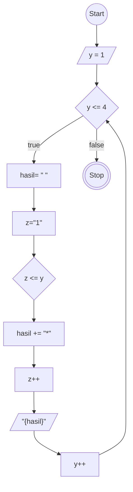

# Javascript

## flowchart

```mermaid
flowchart TD

a@{shape: circle , label : "Start" }
b@{shape: lean-r, label: "y = 1"}
c@{shape: diamond, label: "y <= 4" }
d@{shape: rect, label: 'hasil= " "'}
e@{shape: rect, label: 'z="1"'}
f@{shape: diamond, label: "z <= y"}
g@{shape: rect, label : 'hasil += "*"' }
h@{shape: rect, label : "z++"}
i@{shape: lean-r, label : '"{hasil}"'}
j@{shape: rect, label : "y++"}
k@{shape: dbl-circ, label : "Stop"}

a-->b
b-->c
c--true-->d
d-->e
e-->f
f-->g
g-->h
h-->i
i-->j
j-->c
c--false-->k
```
