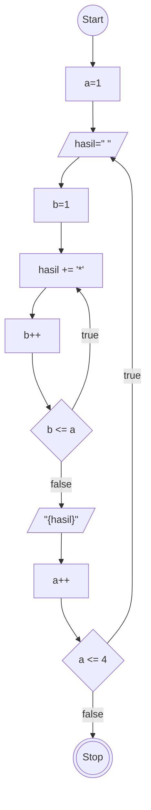

# JavaScript

## Flowchart While do

```mermaid
flowchart TD

a@{shape: circle, label : "Start"}
b@{shape: rect , label : "a=1"}
c@{shape: lean-r, label : 'hasil=" "'}
d@{shape: rect, label : "hasil += '*'"}
e@{shape: rect, label : "b++"}
f@{shape: diamond, label : "b <= a "}
g@{shape: lean-r, label : '"{hasil}"'}
h@{shape: rect, label : "a++"}
i@{shape: diamond, label : "a <= 4"}
j@{shape: dbl-circ, label : "Stop"}
k@{shape: rect, label : "b=1"}

a --> b
b --> c
c --> k
k --> d
d --> e
e --> f
f -- true --> d
f -- false --> g
g --> h
h --> i
i -- true --> c
i -- false --> j

```
